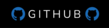
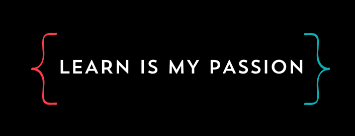

### ¡Hi there 👋! My name is Selim Beltran (Backend Developer)
---
I'm 20 years old and I'm studying in one the best university of Ecuador (ESPOL). When I was young I knew that I went to know all about technology.

Now, I'm learning Android with compose, and my favorite phrase to continue in *this world* is: *Let's build the next app that changes the world*.

I have basic knowledge of:

   

---

